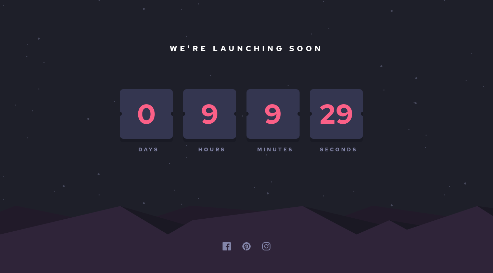

# Launch countdown timer

# This is CHELLENGE from Frontend Mentor site

## Table of contents

- [Overview](#overview)
  - [The challenge](#the-challenge)

## Overview

## Screenshot

### The challenge

Users should be able to:

- See hover states for all interactive elements on the page
- See a live countdown timer that ticks down every second (start the count at 14 days)

### Links

- Solution URL: [Add solution URL here](https://www.frontendmentor.io/solutions/launch-countdown-timer-n6BPm_b9Bg)
- Live Site URL: [Add live site URL here](https://comfy-dusk-6980e9.netlify.app/)

## My process

### Built with

- Semantic HTML5 markup
- CSS custom properties
- Flexbox
- CSS Grid
- [React](https://reactjs.org/) - JS library

## Author

- Frontend Mentor - [@kadan-develop](https://www.frontendmentor.io/profile/kadan-develop)
